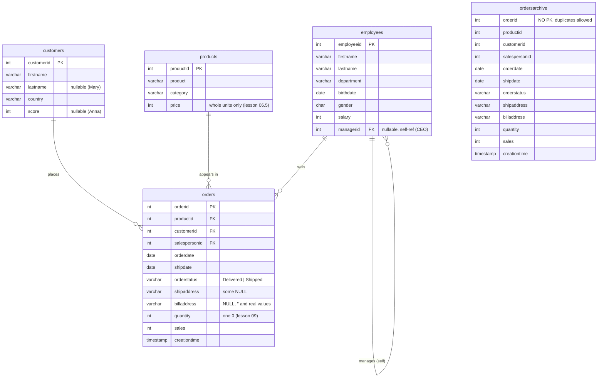

# `salesdb` Schema Reference

The canonical schema for the whole course. Load it with:

```bash
# from the lessons/ directory
psql -U postgres -h localhost -f datasets/postgres/init-postgres-salesdb.sql      # small, for theory
psql -U postgres -h localhost -f datasets/postgres/generate-big-salesdb.sql      # 200k orders, for performance lessons
```

---

## ER diagram



> `ordersarchive` has **no PK and no FKs** by design (lesson 05, exercise 4) — it is not
> connected to the diagram's relationships; treat it as an append-only data dump.

## Crow's foot (ASCII)

```
 ┌───────────┐         ┌──────────────────┐         ┌──────────┐
 │ customers │ 1     N │      orders      │ N     1 │ products │
 │───────────│══╦─────<│──────────────────│>─────═╦══│──────────│
 │◇customerid│         │◇ orderid         │         │◇productid│
 └───────────┘         │  customerid (FK) │         └──────────┘
                       │  productid  (FK) │
 ┌───────────┐         │  salespersonid──┐│
 │ employees │ 1     N │  orderdate      ││
 │───────────│══╦─────<│  shipdate       ││
 │◇employeeid│         │  orderstatus    ││
 │  managerid│──◯ self │  shipaddress    ││
 └───────────┘         │  billaddress    ││
                       │  quantity, sales││
                       │  creationtime   ││
                       └──────┬──────────┘│
                              └───────────┘  (FK → employees.employeeid)
```

`◇` = primary key · `══╦══` = one · `<` = many · `──◯` = optional self-reference.

## Relationships (the 4 FKs you add in lesson 05)

| FK | Cardinality | Suggested `ON DELETE` | Why |
|----|-------------|----------------------|-----|
| `orders.customerid → customers.customerid` | 1:N | `RESTRICT` (default) | never lose order history |
| `orders.productid → products.productid` | 1:N | `RESTRICT` (default) | same |
| `orders.salespersonid → employees.employeeid` | 1:N | `SET NULL` | salesperson leaves, order stays (lesson 05, ex 5) |
| `employees.managerid → employees.employeeid` | 1:N self | `SET NULL` | manager leaves → reports become top-level |

The init script ships **PKs only** — adding these FKs is lesson 05's exercise.

## Data the lessons depend on

| Fact | Where it's used |
|------|-----------------|
| 5 customers / 5 products / 5 employees / 10 orders / 10 archived | lesson 00 sanity check, 19 ex 4 |
| Mary has `NULL` lastname, Anna has `NULL` score | 04, 12, 13, 15.5 |
| Customer 5 (Anna) has **no current orders** (only archive) | anti-joins: 10, 16 |
| No orphan rows anywhere | 03 worked example asserts empty; FK creation in 05 must succeed |
| One `quantity = 0` order (id 10), NULL shipaddresses (ids 5, 10) | 09 ex 6, 13 ex 3, 07 ex 6 |
| `billaddress`: NULL (2,5,6,10), `''` (4,7,9), real (1,3,8) | 13 |
| Addresses ending in `Lane` (orders 4, 8) | 27 ex 6 |
| All 10 orderdates distinct | 18 ex 5 / 21 ex 6 ask "when *would* ROWS vs RANGE differ" |
| Archive has duplicate orderids (4 ×2, 6 ×3) and overlaps orders (ids 1–7) | 11 (UNION 20 → 17) |
| Products 101–105, prices 10–30 INT, no ties | 09 ex 2, 19 ex 1 |
| Employees: 1 root (Frank Lee, `managerid NULL`) | 10 ex 5, 17 |

## How the schema evolves during the course

Some lessons add columns/objects — keep them, later lessons may build on them:

| Lesson | Adds |
|--------|------|
| 04.5 | `orders.created_at / updated_at / deleted_at`, `customers.full_name` (generated), partial unique index |
| 05 | the 4 FKs |
| 06 | `categories`, `tags`, `audit_log` (temp), CHECK `price >= 0` |
| 06.5 | `invoices`, `customers.uuid`, `products.price → NUMERIC(10,2)` |
| 07 | `orders_backup` (temp), customer 6–7, products 106–108 |
| 07.5 | customer 8 (Tara) |
| 22 | `v_order_details`, `mv_monthly` |
| 23 | indexes on `orders(customerid)`, `(customerid, orderdate)`, expression + partial indexes |
| 23.5 | `products.attributes JSONB` + GIN index |
| 24.5 | `products.quantity`, `products.version`, `jobs` |
| 26 | `audit_log` + trigger on `orders` |

## `bigsalesdb`

Same four table shapes (no archive), FKs pre-applied, generated data:

| Table | Rows | Notes |
|-------|------|-------|
| customers | 10,000 | ~9% NULL scores, ~6% NULL lastnames |
| products | 500 | 5 categories |
| employees | 1,000 | shallow hierarchy, 50 top managers |
| orders | 200,000 | 2023–2024, skewed customers ("whales"), ~80% Delivered |

Use it for lessons 22.5, 23, 27, 27.5 and any `EXPLAIN ANALYZE` work — the small
`salesdb` is intentionally too small for the planner to show you anything.

---

*This diagram is the reference for your Drizzle schema (Phase 1 of your learning plan):
one `pgTable` per box, `references()` per FK, `.onDelete` per the table above.*
