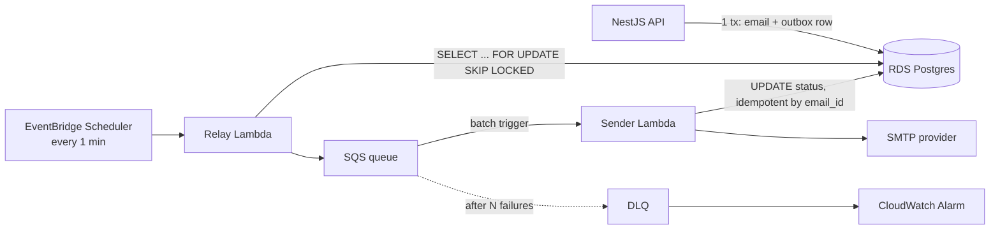

# Future Plans — Backend & AWS Learning Roadmap

Context: frontend developer transitioning to fullstack. This file tracks the learning path,
the next project, and the AWS services/concepts to acquire — in order.

Last updated: 2026-08-13

---

## Current state (done)

- [x] NestJS synchronous email sender (`features/email-sender/synchronous-sender`)
- [x] PostgreSQL + Drizzle ORM (schema, migrations, seed)
- [x] S3 file upload (templates, LocalStack)
- [x] Mailer (nodemailer / SMTP)
- [x] Queues (queued file upload)
- [x] Terraform definitions (`features/email-sender/terraform`)

---

## Phase 1 — Finish the lessons in `synchronous-sender`

Full review produced 28 findings. These are the ones that teach concepts — do them first.
Effort: S = <30 min, M = 30 min–2 h, L = half-day+

### Correctness / contract

| # | Change | Effort |
|---|---|---|
| 1 | Add `GET /templates` + return `id` in upload response — the API is unusable end-to-end without it | M |
| 2 | `bootstrap()` `.catch()` + `enableShutdownHooks()`; drain pg pool on shutdown | S |
| 3 | Unify bulk error model — per-recipient failures of any kind land in `failures[]`, loop continues | M |
| 4 | Tighten Zod schemas (`z.uuid()`, `int().positive()`, `min(1)`) — turn DB-thrown 500s into 400s | S |
| 5 | Fix `sentAt` semantics — no `defaultNow()`, set only on success (or rename `processedAt`) — migration needed | M |
| 6 | Sync `.env.example` with reality (`SMTP_*`, `S3_BUCKET_NAME`); one config policy | S |
| 7 | `git rm --cached .env` — it's tracked despite being ignored | S |
| 8 | Bound the bulk loop (pagination + limited concurrency, or document the ceiling) | M |
| 9 | Close the upload saga gap (stale `pending` templates / orphan S3 objects) | M |

### Error contract

| # | Change | Effort |
|---|---|---|
| 10 | Stop leaking raw S3/SMTP errors into HTTP responses | S |
| 11 | Global exception filter — one error response shape | M |
| 12 | Read access to the audit trail (`GET /email-send`) | M |

### Hygiene sweep (one pass)

Rename `EmailSender` → `EmailSendModule`; drop dead deps (`handlebars`, `@nestjs/mapped-types`);
`node:crypto` import; `import type` for `DrizzleSchema`; import ordering per AGENTS.md; `readonly`
constructor props; `BUCKET_NAME` initializer; template status enum naming + column rename (migration);
`formatZodErrors` shape; `<=` in file-size pipe; consistent pipe application; `@HttpCode(200)`.

**Concepts this phase teaches:** consumer-driven API design, data modeling (what does a column
*claim*?), process/resource lifecycle, error model as API contract.

---

## Phase 2 — Next project: async email sender

**Goal:** AWS Lambda + outbox pattern + idempotency. Sibling of `synchronous-sender`.

### Target architecture

### Design decisions to implement deliberately

1. **The transaction is the pattern** — `emails` row + `outbox` row commit atomically.
   (The sync sender's write-ahead journal was the seed of this.)
2. **`FOR UPDATE SKIP LOCKED`** — safe concurrent polling of the outbox.
3. **Idempotency = a unique constraint on `email_id`** in the sender — a database guarantee,
   not a code check. SQS delivers at-least-once; duplicates must be harmless.
4. **DLQ + CloudWatch alarm on depth > 0** — poison messages are a certainty, not a risk.
5. **IAM least privilege** — relay Lambda reads DB + writes one queue; sender Lambda reads
   one queue + writes DB. Nothing else.
6. **Secrets Manager** for SMTP credentials — no `.env` in the cloud.
7. **Correlation ID** threaded API → outbox → SQS → Lambda, JSON structured logs.

---

## Phase 3 — AWS learning roadmap

### Tier 1 — must know (the async sender teaches these)

| Service | Core lesson |
|---|---|
| Lambda | Execution model: cold starts, init outside handler, concurrency |
| IAM | Roles not keys; least privilege — the single most important AWS skill |
| SQS (deep) | Visibility timeout, redrive policy, DLQ, at-least-once delivery |
| EventBridge Scheduler | Cron as a service — the outbox relay trigger |
| CloudWatch | Structured logs, metrics, alarms (DLQ depth) |
| Secrets Manager / SSM | Runtime secrets; kills the `.env` pattern |
| RDS | Managed Postgres — same engine, new connectivity model |
| API Gateway (HTTP API) | Front door for Lambda |

### Tier 2 — within a few months (fullstack-critical)

| Service | Why |
|---|---|
| VPC fundamentals | Subnets, security groups; Lambda-in-VPC loses internet without NAT ($) |
| ECR + ECS/Fargate | Where the NestJS API runs in prod; containers vs Lambda hosting models |
| CloudFront + S3 hosting | Standard fullstack deploy shape (Vite build + CDN) |
| Cognito (or JWT/OIDC) | Auth — biggest remaining frontend-to-backend gap |
| SNS | Pub/sub fan-out (SNS -> many SQS) |
| ElastiCache (Redis) | Cache, rate limiting, distributed locks |
| S3 presigned URLs | Browser uploads directly to S3 — replaces multer proxying |

### Tier 3 — awareness only (don't deep-dive yet)

Step Functions, Kinesis, DynamoDB Streams, Aurora, X-Ray, CloudTrail, WAF, CDK.
Know what problem each solves; learn them when a project demands it.

### Concepts that aren't services

1. **Delivery semantics** — queues promise at-least-once; exactly-once *processing* is your code's job.
2. **Poison messages & DLQs** — redrive policy + alarm is the safety net.
3. **Retries with jittered exponential backoff** — default answer for transient failures.
4. **Cold starts & execution reuse** — warm containers persist; DB pool outside the handler.
5. **Lambda <-> RDS tension** — 1000 concurrent Lambdas vs ~100 Postgres connections
   (RDS Proxy, or SQS buffering between them).
6. **Roles, not keys** — services assume IAM roles; no credentials in code.
7. **Structured logs + correlation IDs** — JSON logs, CloudWatch Insights queries.
8. **Cost literacy** — NAT gateways, log retention, per-request pricing; check the bill weekly.

### Skip for now

Kubernetes/EKS, Step Functions, Kinesis, microservice decomposition, multi-region.
Valid year-2 topics; none helps ship the async sender.

---

## Milestones

- **Proficient junior AWS backend** = Tier 1 + concepts 1–6
- **Credible fullstack** = + Tier 2 + auth
- Rule: no new breadth until the async sender ships — DLQ alarm included.
